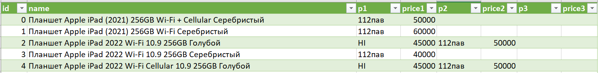
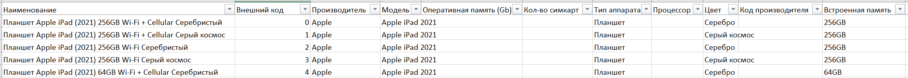
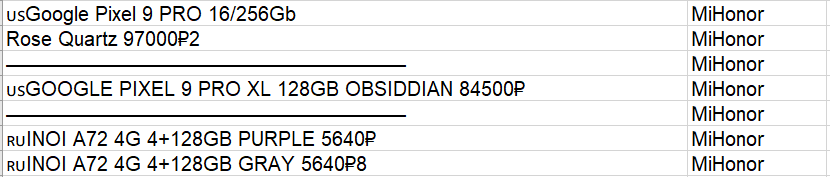

# Тестовое задание на позицию Junior Python developer

Этот проект представляет собой парсер для сопосталения товаров маазина с товарами поставщиков. На выходе получаются 2 таблицы: 

'итоговая таблица.csv' со сравнением цен от разных поставщиков:

'сопоставленные данные.csv', где можно отследить какие именно строчки из двух изначальных таблиц соотнеслись и какой словарь получился:

## Требования

Python 3.9

В корне проекта должны находиться два файла для сопоставления:

1) 'Товары магазина.xlsx' - файл с товарами в виде: 

2) 'Прайсы с телеграма.xlsx' - файл, составенный из переписок с поставщиками, в 1 колонке содержится переписка с выставленными ценами, во 2 - название поставщика:

## Установка

1. Клонируйте репозиторий:

`https://github.com/Leila132/Parser-for-products.git`

2. Перейдите в директорию проекта:

`cd Parser-for-products`

3. Установите зависимости:

`pip install -r requirements.txt`

## Запуск

Чтобы запустить проект, выполните:

`python pt_pars.py`